# Question Map — How does extreme heat affect health and wellbeing in urban communities?

This map shows the main research questions emerging from the retrieved literature.
Themes appear as circles on the left, related questions in the middle, and supporting
sources as cards on the right. Source cards distinguish stated questions from inferred questions.
Solid links show direct support; dashed `related` links show secondary conceptual relationships.

This first pass identified 20 selected sources, 7 core questions across 6 themes, and 5 possible next questions.

```mermaid
flowchart LR
    theme_001(("Health outcomes and service burden")):::theme
    q_002["<div style='text-align:left'>How does extreme heat or heatwave exposure affect healthcare utilization, including emergency-department, outpatient, and hospital encounters in urban communities?</div>"]:::question
    theme_001 --> q_002
    src_001["<div style='width:340px;text-align:left'><a href='https://search-library.ucsd.edu/discovery/search?query=any,contains,%22Heat Waves and Emergency Department Visits Among the Homeless, San Diego, 2012–2019%22'>Schwarz et al. (2022)</a> — <i>• Stated — To determine the effect of heat waves on emergency department visits among people experiencing homelessness and explore vulnerability factors.</i></div>"]:::source
    q_002 --> src_001
    src_003["<div style='width:340px;text-align:left'><a href='https://search-library.ucsd.edu/discovery/search?query=any,contains,%22Impact of heatwave intensity using excess heat factor on emergency department presentations and related healthcare costs in Adelaide, South Australia%22'>Wondmagegn et al. (2021)</a> — <i>• Stated — How do heatwave intensity and excess heat factor relate to emergency-department presentation costs and attributable morbidity burden in Adelaide?</i></div>"]:::source
    q_002 --> src_003
    src_020["<div style='width:340px;text-align:left'><a href='https://search-library.ucsd.edu/discovery/search?query=any,contains,%22The impact of extreme temperatures on emergency department visits: A systematic review of heatwaves, cold waves, and daily temperature variations%22'>PoshtMashhadi et al. (2025)</a> — <i>• Stated — What is the influence of extreme temperature events on emergency-department visits, and which populations face disproportionate consequences?</i></div>"]:::source
    q_002 --> src_020
    src_002["<div style='width:340px;text-align:left'><a href='https://search-library.ucsd.edu/discovery/search?query=any,contains,%22Temperature and mental health–related emergency department and hospital encounters among children, adolescents and young adults%22'>Niu et al. (2023)</a> — <i>• Stated — How does high ambient temperature relate to acute mental-health healthcare encounters among children, adolescents, and young adults in New York City?</i></div>"]:::source
    q_002 -. related .-> src_002
    src_012["<div style='width:340px;text-align:left'><a href='https://search-library.ucsd.edu/discovery/search?query=any,contains,%22Association Between Extreme Heat and Outpatient Visits for Mental Disorders: A Time‐Series Analysis in Guangzhou, China%22'>Zhang et al. (2024)</a> — <i>• Inferred — What is the association between extreme heat and outpatient visits for mental disorders in Guangzhou, China?</i></div>"]:::source
    q_002 -. related .-> src_012
    src_019["<div style='width:340px;text-align:left'><a href='https://search-library.ucsd.edu/discovery/search?query=any,contains,%22Impact of Extreme Heat on Emergency Department Admissions for Childhood and Adult Asthma: An Evaluation of Earth Observations and Heat Wave Definitions%22'>Corpuz et al. (2026)</a> — <i>• Stated — How do heat-wave definitions and the spatial resolution of temperature data affect associations between extreme heat and asthma-related emergency-department admissions in Baltimore?</i></div>"]:::source
    q_002 -. related .-> src_019
    q_003["<div style='text-align:left'>How does extreme heat or heatwave exposure affect mortality and morbidity in urban populations?</div>"]:::question
    theme_001 --> q_003
    src_004["<div style='width:340px;text-align:left'><a href='https://search-library.ucsd.edu/discovery/search?query=any,contains,%22Excess mortality associated with extreme heat in Rio de Janeiro, Brazil, 2023%22'>Fernández-Medina et al. (2025)</a> — <i>• Stated — How much excess mortality was associated with the November 2023 extreme heat wave in Rio de Janeiro, and which groups were disproportionately affected?</i></div>"]:::source
    q_003 --> src_004
    src_006["<div style='width:340px;text-align:left'><a href='https://search-library.ucsd.edu/discovery/search?query=any,contains,%22How Blackouts during Heat Waves Amplify Mortality and Morbidity Risk%22'>Stone et al. (2023)</a> — <i>• Inferred — How do blackouts during heat waves amplify mortality and morbidity risk?</i></div>"]:::source
    q_003 --> src_006
    q_003 -. related .-> src_003
    src_005["<div style='width:340px;text-align:left'><a href='https://search-library.ucsd.edu/discovery/search?query=any,contains,%22Urban heat island effect-related mortality under extreme heat and non-extreme heat scenarios: A 2010–2019 case study in Hong Kong%22'>Ho et al. (2022)</a> — <i>• Stated — How does the urban heat island effect differ under extreme versus non-extreme heat scenarios, and how do these scenarios relate to mortality in Hong Kong?</i></div>"]:::source
    q_003 -. related .-> src_005
    src_007["<div style='width:340px;text-align:left'><a href='https://search-library.ucsd.edu/discovery/search?query=any,contains,%22Daytime, nighttime, and day-night compound heatwaves and the risk of depression: A Chinese nationwide cohort%22'>Shen et al. (2025)</a> — <i>• Inferred — How are daytime, nighttime, and day-night compound heatwaves associated with depression risk in a Chinese nationwide cohort?</i></div>"]:::source
    q_003 -. related .-> src_007
    src_008["<div style='width:340px;text-align:left'><a href='https://search-library.ucsd.edu/discovery/search?query=any,contains,%22Identifying vulnerability factors associated with heatwave mortality: a spatial statistical analysis across Europe%22'>Sestito et al. (2025)</a> — <i>• Inferred — Which vulnerability factors are associated with heatwave mortality across Europe?</i></div>"]:::source
    q_003 -. related .-> src_008
    src_009["<div style='width:340px;text-align:left'><a href='https://search-library.ucsd.edu/discovery/search?query=any,contains,%22Risk factors associated with heatwave mortality in Chinese adults over 65 years%22'>Xi et al. (2024)</a> — <i>• Inferred — Which risk factors are associated with heatwave mortality among Chinese adults over 65 years?</i></div>"]:::source
    q_003 -. related .-> src_009
    src_017["<div style='width:340px;text-align:left'><a href='https://search-library.ucsd.edu/discovery/search?query=any,contains,%22Temporal variation in the association between heatwave and mortality from mental disorders: population-based evidence from a megacity of China%22'>Tao et al. (2025)</a> — <i>• Stated — How does the heatwave association with mental-disorder mortality vary over time, and how can the effect be decomposed into intensity and duration components?</i></div>"]:::source
    q_003 -. related .-> src_017
    q_008["<div style='text-align:left'>How do heatwave definitions, spatial data resolution, and health-wellbeing instruments affect measurement of heat-health impacts?</div>"]:::question
    theme_001 -. cross-cutting .-> q_008

    theme_002(("Mental health and wellbeing")):::theme
    theme_002 -. cross-cutting .-> q_003
    theme_002 -. cross-cutting .-> q_008
    q_004["<div style='text-align:left'>How does extreme heat or heatwave exposure affect mental health and depression in urban populations?</div>"]:::question
    theme_002 --> q_004
    q_004 --> src_002
    q_004 --> src_007
    q_004 --> src_012
    q_004 --> src_017
    src_011["<div style='width:340px;text-align:left'><a href='https://search-library.ucsd.edu/discovery/search?query=any,contains,%22Urban heatwave, green spaces, and mental health: A review based on environmental health risk assessment framework%22'>Huang et al. (2024)</a> — <i>• Inferred — How do urban green spaces mitigate mental-health risks during urban heatwaves?</i></div>"]:::source
    q_004 -. related .-> src_011
    src_016["<div style='width:340px;text-align:left'><a href='https://search-library.ucsd.edu/discovery/search?query=any,contains,%22Validity and responsiveness of the EQ-5D-5L, EQ-HWB and EQ-HWB-9 to measure health and wellbeing impact of heatwaves among older adults%22'>Liao et al. (2026)</a> — <i>• Stated — Can the EQ-5D-5L, EQ-HWB, and EQ-HWB-9 measures capture the health and wellbeing impact of heatwaves among older adults?</i></div>"]:::source
    q_004 -. related .-> src_016
    src_018["<div style='width:340px;text-align:left'><a href='https://search-library.ucsd.edu/discovery/search?query=any,contains,%22Responses to heat waves: what can Twitter data tell us?%22'>Zander et al. (2023)</a> — <i>• Stated — What can Twitter data reveal about how people feel about heat waves and respond to them?</i></div>"]:::source
    q_004 -. related .-> src_018

    theme_003(("Unequal vulnerability and climate justice")):::theme
    q_005["<div style='text-align:left'>Which social, demographic, historical, environmental, and infrastructure factors create unequal heat-health vulnerability in urban communities?</div>"]:::question
    theme_003 --> q_005
    q_005 --> src_008
    q_005 --> src_009
    q_005 -. related .-> src_001
    q_005 -. related .-> src_004
    src_010["<div style='width:340px;text-align:left'><a href='https://search-library.ucsd.edu/discovery/search?query=any,contains,%22Individual heat adaptation: Analyzing risk communication, warnings, heat risk perception, and protective behavior in three German cities%22'>Heidenreich et al. (2024)</a> — <i>• Stated — How do risk communication, warnings, heat-risk perception, and protective behavior shape individual heat adaptation in three German cities?</i></div>"]:::source
    q_005 -. related .-> src_010
    src_013["<div style='width:340px;text-align:left'><a href='https://search-library.ucsd.edu/discovery/search?query=any,contains,%22Mapping urban heat islands and heat-related risk during heat waves from a climate justice perspective: A case study in the municipality of Padua (Italy) for inclusive adaptation policies%22'>Pappalardo et al. (2023)</a> — <i>• Stated — How do urban heat islands and heat-related risk vary across Padua, and how can mapping support inclusive adaptation policies?</i></div>"]:::source
    q_005 -. related .-> src_013
    src_014["<div style='width:340px;text-align:left'><a href='https://search-library.ucsd.edu/discovery/search?query=any,contains,%22The Effects of Historical Housing Policies on Resident Exposure to Intra-Urban Heat: A Study of 108 US Urban Areas%22'>Hoffman et al. (2020)</a> — <i>• Stated — How do historical housing policies affect resident exposure to intra-urban heat across 108 United States urban areas?</i></div>"]:::source
    q_005 -. related .-> src_014
    src_015["<div style='width:340px;text-align:left'><a href='https://search-library.ucsd.edu/discovery/search?query=any,contains,%22Urban and Rural Environments and Their Implications for Older Adults’ Adaptation to Heat Waves: A Systematic Review%22'>Grela et al. (2024)</a> — <i>• Stated — How do urban and rural environments affect older adults’ adaptation to heat waves?</i></div>"]:::source
    q_005 -. related .-> src_015
    q_005 -. related .-> src_020
    q_006["<div style='text-align:left'>How do urban heat islands, green space, historical land-use, and other built-environment factors shape heat exposure and heat-health risk?</div>"]:::question
    theme_003 --> q_006
    q_006 --> src_005
    q_006 --> src_011
    q_006 --> src_013
    q_006 --> src_014
    q_006 -. related .-> src_006
    q_007["<div style='text-align:left'>How do people perceive, communicate about, and adapt to heat risk in urban and peri-urban settings?</div>"]:::question
    theme_003 --> q_007
    q_007 --> src_010
    q_007 --> src_015
    q_007 --> src_018

    theme_004(("Urban form and mitigation")):::theme
    theme_004 -. cross-cutting .-> q_003
    theme_004 -. cross-cutting .-> q_005
    theme_004 -. cross-cutting .-> q_006

    theme_005(("Adaptation and response")):::theme
    theme_005 -. cross-cutting .-> q_005
    theme_005 -. cross-cutting .-> q_007

    theme_006(("Measurement and evidence quality")):::theme
    theme_006 -. cross-cutting .-> q_002
    theme_006 --> q_008
    q_008 --> src_016
    q_008 --> src_019
    theme_006 -. cross-cutting .-> q_004

    classDef theme fill:#ecfeff,stroke:#0e7490,stroke-width:2px;
    classDef question fill:#f8fafc,stroke:#334155,stroke-width:1px,text-align:left;
    linkStyle 16,17,18,47,48,49,50,51,52,56 stroke:#94a3b8,stroke-width:1px,stroke-dasharray:4 3;
    linkStyle 4,5,6,10,11,12,13,14,15,24,25,26,30,31,32,33,34,35,36,42 stroke:#94a3b8,stroke-width:1px,stroke-dasharray:7 4,stroke-opacity:.65;
    classDef source fill:#fffbeb,stroke:#b45309,stroke-width:1px,text-align:left;
```

## Where would you like to go next?

Questions to explore:

- How do locally resolved nighttime heat metrics affect associations between heat exposure and asthma-related emergency-department admissions in socially vulnerable neighborhoods?
- How do compound daytime-nighttime heatwaves affect depression and other mental-health outcomes across different urban climate contexts?
- How do heat action plans address people experiencing homelessness, and how effective are those plans in reducing heat-health service use?
- Can survey-based health and wellbeing instruments measure heat-related impacts among older adults across urban and rural contexts?
- How do historical housing policies explain present-day intra-urban heat exposure and associated mortality risk?

You can use this map as a launching point for your own inquiry. For example, you might:

- ask me to explore one theme in more depth;
- choose a question and turn it into a targeted UC Library Search;
- request a focused annotated bibliography from one or more questions;
- pick one of the questions to explore and start a new inquiry from it.

Tell me which theme, question, or future-research question interests you, and I can take it from there.
