# Question Map — How does extreme heat affect health and wellbeing in urban communities?

This map shows the main research questions emerging from the retrieved literature.
Themes appear as circles on the left, related questions in the middle, and supporting
sources as cards on the right. Each source card names the source’s stated question.

This first pass identified 23 selected sources, 8 core questions across 6 themes, and 6 possible next questions.

```mermaid
flowchart LR
    theme_001(("Exposure burden and measurement")):::theme
    q_001["<div style='text-align:left'>How has urban population exposure to extreme heat changed, and what drives it?</div>"]:::question
    theme_001 --> q_001
    src_002["<div style='width:340px;text-align:left'><a href='https://search-library.ucsd.edu/permalink/01UCS_SDI/qkke1q/cdi_jstor_primary_27093397'>Tuholske, Cascade, Caylor, Kelly, Funk, Chris, et al. (2021)</a> — <i>• How has urban population exposure to extreme heat changed over time and what drives it?</i></div>"]:::source
    q_001 -.-> src_002
    src_021["<div style='width:340px;text-align:left'><a href='https://search-library.ucsd.edu/permalink/01UCS_SDI/qkke1q/cdi_proquest_journals_3371417708'>Ock, YunJae, Shandas, Vivek (2026)</a> — <i>• Are historically segregated neighborhoods exposed to longer durations of heat?</i></div>"]:::source
    q_001 -.-> src_021
    q_008["<div style='text-align:left'>How should extreme heat exposure be measured to support urban planning and public health?</div>"]:::question
    theme_001 --> q_008
    src_019["<div style='width:340px;text-align:left'><a href='https://search-library.ucsd.edu/permalink/01UCS_SDI/qkke1q/cdi_proquest_miscellaneous_2409647255'>Hammer, Jason, Ruggieri, Dominique G., Thomas, Chad, et al. (2020)</a> — <i>• How can a heat vulnerability index support local extreme heat planning?</i></div>"]:::source
    q_008 -.-> src_019

    theme_002(("Physical health burden")):::theme
    q_002["<div style='text-align:left'>How does extreme heat affect physical health outcomes in urban populations?</div>"]:::question
    theme_002 --> q_002
    src_009["<div style='width:340px;text-align:left'><a href='https://search-library.ucsd.edu/permalink/01UCS_SDI/qkke1q/cdi_pubmed_primary_38153655'>Gossack-Keenan, Kira, Yeom, David Seonguk, Kanu, Josephine, et al. (2024)</a> — <i>• What presentation, treatment, and outcome patterns occurred among urban heatstroke patients during an extreme heat event?</i></div>"]:::source
    q_002 -.-> src_009
    src_010["<div style='width:340px;text-align:left'><a href='https://search-library.ucsd.edu/permalink/01UCS_SDI/qkke1q/cdi_crossref_primary_10_1001_jamanetworkopen_2026_2645'>Siau, Evan, Silva, Genevieve S., Lu, Jeremy, et al. (2026)</a> — <i>• How is extreme heat associated with all-cause emergency department use among older adults?</i></div>"]:::source
    q_002 -.-> src_010
    src_011["<div style='width:340px;text-align:left'><a href='https://search-library.ucsd.edu/permalink/01UCS_SDI/qkke1q/cdi_pubmedcentral_primary_oai_pubmedcentral_nih_gov_10599453'>Cleland, Stephanie E., Steinhardt, William, Neas, Lucas M., et al. (2023)</a> — <i>• How does heat-related cardiovascular morbidity vary with urban heat island intensity and population subgroups?</i></div>"]:::source
    q_002 -.-> src_011
    src_012["<div style='width:340px;text-align:left'><a href='https://search-library.ucsd.edu/permalink/01UCS_SDI/qkke1q/cdi_pubmedcentral_primary_oai_pubmedcentral_nih_gov_11892670'>O’Lenick, Cassandra R., Cleland, Stephanie E., Neas, Lucas M., et al. (2025)</a> — <i>• How does high heat affect respiratory hospitalizations among older adults across U.S. urban areas?</i></div>"]:::source
    q_002 -.-> src_012
    src_013["<div style='width:340px;text-align:left'><a href='https://search-library.ucsd.edu/permalink/01UCS_SDI/qkke1q/cdi_pubmed_primary_31277359'>Williams, Augusta A., Spengler, John D., Catalano, Paul, et al. (2019)</a> — <i>• How do indoor temperatures during an extreme heat event relate to sleep, physiology, and symptoms among older adults in public housing?</i></div>"]:::source
    q_002 -.-> src_013
    src_017["<div style='width:340px;text-align:left'><a href='https://search-library.ucsd.edu/permalink/01UCS_SDI/qkke1q/alma9914834029806531'>Kim, Jiyoon (2019)</a> — <i>• How does prenatal exposure to extreme heat affect maternal health?</i></div>"]:::source
    q_002 -.-> src_017

    theme_003(("Mental health and wellbeing")):::theme
    q_003["<div style='text-align:left'>How does extreme heat affect mental health and wellbeing in urban communities?</div>"]:::question
    theme_003 --> q_003
    src_004["<div style='width:340px;text-align:left'><a href='https://search-library.ucsd.edu/permalink/01UCS_SDI/qkke1q/cdi_crossref_primary_10_1289_isee_2024_1923'>Espinoza Tilleria, Maria Loreto, Herrera, Ignacio, Carrasco, Mauricio (2024)</a> — <i>• Are neighborhood heat islands associated with increased mental health emergencies in Gran Santiago?</i></div>"]:::source
    q_003 -.-> src_004
    src_005["<div style='width:340px;text-align:left'><a href='https://search-library.ucsd.edu/permalink/01UCS_SDI/qkke1q/cdi_pubmed_primary_38145084'>Yang, Ying, Zhang, Yixin, Sheng, Shaojie (2023)</a> — <i>• Can residential greenness mitigate the effects of extreme heat events on depression and support mental health?</i></div>"]:::source
    q_003 -.-> src_005
    src_006["<div style='width:340px;text-align:left'><a href='https://search-library.ucsd.edu/permalink/01UCS_SDI/qkke1q/cdi_pubmedcentral_primary_oai_pubmedcentral_nih_gov_12548616'>Chukwusa, Emeka, Vivaldi, Giulia, Baecker, Lea, et al. (2025)</a> — <i>• What are the effects of extreme heat events on mental health, service use, and wellbeing in vulnerable urban populations?</i></div>"]:::source
    q_003 -.-> src_006
    src_016["<div style='width:340px;text-align:left'><a href='https://search-library.ucsd.edu/permalink/01UCS_SDI/qkke1q/cdi_pubmedcentral_primary_oai_pubmedcentral_nih_gov_12338078'>Vrkljan, Kaylin A., Oblath, Rachel, Black‐Ingersoll, Flannery, et al. (2025)</a> — <i>• Is extreme heat associated with psychiatric emergency encounters among vulnerable pregnant people?</i></div>"]:::source
    q_003 -.-> src_016
    src_023["<div style='width:340px;text-align:left'><a href='https://search-library.ucsd.edu/permalink/01UCS_SDI/qkke1q/cdi_proquest_miscellaneous_2802424580'>Niu, Li, Girma, Blean, Liu, Bian, et al. (2023)</a> — <i>• How is high ambient temperature associated with acute mental health-related healthcare encounters among young people in New York City?</i></div>"]:::source
    q_003 -.-> src_023

    theme_004(("Everyday life and social consequences")):::theme
    q_004["<div style='text-align:left'>How does extreme heat affect everyday mobility, livelihoods, and social life in urban communities?</div>"]:::question
    theme_004 --> q_004
    src_007["<div style='width:340px;text-align:left'><a href='https://search-library.ucsd.edu/permalink/01UCS_SDI/qkke1q/cdi_pubmedcentral_primary_oai_pubmedcentral_nih_gov_13254552'>Olaitan, Adetoun Mustapha, Egbogah, Ifeoma, Osuolale, Kazeem Adewale, et al. (2026)</a> — <i>• How do Nigerian adults perceive extreme heat impacts on physical, mental, and financial wellbeing?</i></div>"]:::source
    q_004 -.-> src_007
    src_008["<div style='width:340px;text-align:left'><a href='https://search-library.ucsd.edu/permalink/01UCS_SDI/qkke1q/cdi_doaj_primary_oai_doaj_org_article_a8cde0af82194c9baaeeb5b72ced6ff0'>Kadio, Kadidiatou, Filippi, Veronique, Congo, Mariam, et al. (2024)</a> — <i>• How does extreme heat affect women’s health, caregiving, and social relationships in Burkina Faso?</i></div>"]:::source
    q_004 -.-> src_008
    src_014["<div style='width:340px;text-align:left'><a href='https://search-library.ucsd.edu/permalink/01UCS_SDI/qkke1q/cdi_crossref_primary_10_1007_s11524_024_00892_6'>Mitsova, Diana, Besser, Lilah M., Le, Elaine T. (2024)</a> — <i>• How do summer heat and historic redlining relate to neighborhood walking among older adults?</i></div>"]:::source
    q_004 -.-> src_014
    src_015["<div style='width:340px;text-align:left'><a href='https://search-library.ucsd.edu/permalink/01UCS_SDI/qkke1q/cdi_proquest_miscellaneous_2886044961'>Yanez Serrano, Paloma, Torrego Gomez, Daniel, Bienkowska, Zosia (2023)</a> — <i>• How do older adults in Madrid adapt to extreme heat under energy vulnerability?</i></div>"]:::source
    q_004 -.-> src_015
    src_018["<div style='width:340px;text-align:left'><a href='https://search-library.ucsd.edu/permalink/01UCS_SDI/qkke1q/cdi_pubmed_primary_40067571'>Azan, Alexander, Choi, Jin, Matthay, Ellicott C., et al. (2025)</a> — <i>• How is heat exposure associated with crime in cities across the United States?</i></div>"]:::source
    q_004 -.-> src_018

    theme_005(("Unequal exposure and vulnerability")):::theme
    q_005["<div style='text-align:left'>Which urban populations and neighborhoods are disproportionately exposed to or harmed by extreme heat?</div>"]:::question
    theme_005 --> q_005

    theme_006(("Adaptation and governance")):::theme
    q_006["<div style='text-align:left'>Which built-environment, housing, and health-system interventions reduce urban heat-related risks?</div>"]:::question
    theme_006 --> q_006
    src_001["<div style='width:340px;text-align:left'><a href='https://search-library.ucsd.edu/permalink/01UCS_SDI/qkke1q/cdi_who_iris_10665_384966'>ha Nasari, Ala, Marzouk, Sammer (2026)</a> — <i>• How should cities design and implement heat adaptation to reduce health burdens and inequities?</i></div>"]:::source
    q_006 -.-> src_001
    src_020["<div style='width:340px;text-align:left'><a href='https://search-library.ucsd.edu/permalink/01UCS_SDI/qkke1q/cdi_proquest_miscellaneous_2843034104'>Turner, V. Kelly, Middel, Ariane, Vanos, Jennifer K. (2023)</a> — <i>• How can shade reduce urban heat risk and reverse shade inequity?</i></div>"]:::source
    q_006 -.-> src_020
    q_007["<div style='text-align:left'>How do governance and institutional responses address emergency and chronic dimensions of urban heat vulnerability?</div>"]:::question
    theme_006 --> q_007
    src_003["<div style='width:340px;text-align:left'><a href='https://search-library.ucsd.edu/permalink/01UCS_SDI/qkke1q/cdi_proquest_journals_1891110268'>Bolitho, Annie, Miller, Fiona (2017)</a> — <i>• How do policy and institutional responses address emergency and chronic dimensions of urban heat vulnerability?</i></div>"]:::source
    q_007 -.-> src_003
    src_022["<div style='width:340px;text-align:left'><a href='https://search-library.ucsd.edu/permalink/01UCS_SDI/qkke1q/cdi_pubmedcentral_primary_oai_pubmedcentral_nih_gov_12763546'>Mahmood, Atiya, Zhu, Leticia, Wei, Cindy, et al. (2025)</a> — <i>• How do older adults and community partners perceive heat risks, preparedness, and service delivery?</i></div>"]:::source
    q_007 -.-> src_022

    classDef theme fill:#ecfeff,stroke:#0e7490,stroke-width:2px;
    classDef question fill:#f8fafc,stroke:#334155,stroke-width:1px,text-align:left;
    classDef source fill:#fffbeb,stroke:#b45309,stroke-width:1px,text-align:left;
```

## Where would you like to go next?

Questions to explore:

- How do heat exposure metrics compare in predicting physical and mental health outcomes across cities?
- How do green space interventions affect both heat exposure duration and mental health outcomes?
- How do heat-action plans affect emergency versus chronic vulnerability in low-income urban neighborhoods?
- How do indoor temperatures mediate heat impacts among older adults in public housing?
- How do heat effects on pregnancy and maternal health vary by urban adaptation and race/ethnicity?
- How do heat-crime associations vary by neighborhood disadvantage and green space?

You can use this map as a launching point for your own inquiry. For example, you might:

- ask me to explore one theme in more depth;
- choose a question and turn it into a targeted UC Library Search;
- request a focused annotated bibliography from one or more questions;
- pick one of the questions to explore and start a new inquiry from it.

Tell me which theme, question, or future-research question interests you, and I can take it from there.
